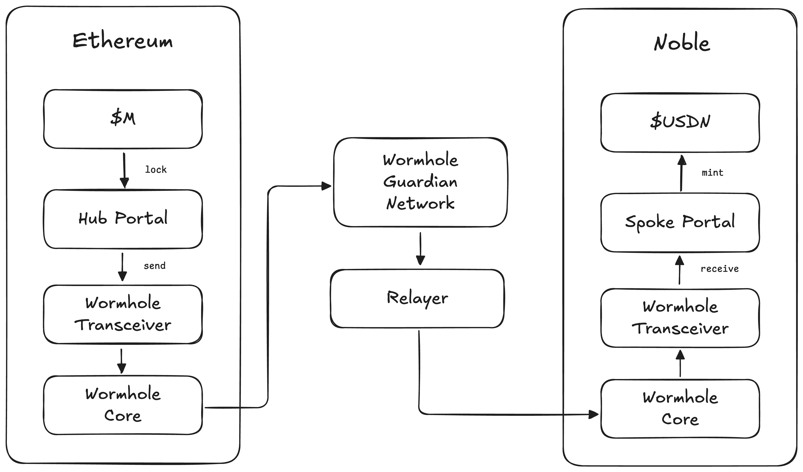

# `x/dollar`

This repository contains a native Cosmos SDK module that implements the Noble Dollar, \$USDN. The Noble Dollar is the first stablecoin leveraging M^0's canonical stablecoin building block, \$M, as its foundation. Its purpose is to serve as a dollar stablecoin that programmatically directs yield to the Cosmos ecosystem! Read the announcement article by [The Block][article].

## Architecture Overview

### Issuance of $USDN

Because the Noble Dollar is collateralized by \$M, issuance can only happen by locking \$M as collateral on Ethereum. This is done by utilizing M^0's Portal product, their custom cross-chain bridge powered by Wormhole's [Native Token Transfer][ntt] specification.

### Distribution of Yield

The module continuously keeps track of every $USDN holders principal on Noble, based on the latest rebasing multiplier from the M^0 protocol on Ethereum. This allows users to claim their yield on demand, whenever an updated multiplier is delivered from Ethereum.

## Specification Overview

- [01 — State](../spec/01_state.md)
  - [01 — Portal State](../spec/01_state_portal.md)
- [02 — Messages](../spec/02_messages.md)
  - [02 — Portal Messages](../spec/02_messages_portal.md)
- [03 — Queries](../spec/03_queries.md)
  - [03 — Portal Queries](../spec/03_queries_portal.md)

[article]: https://www.theblock.co/post/329332/cosmos-based-noble-first-to-launch-custom-stablecoin-using-cryptodollar-infrastructure-startup-m0
[ntt]: https://wormhole.com/docs/learn/messaging/native-token-transfers
