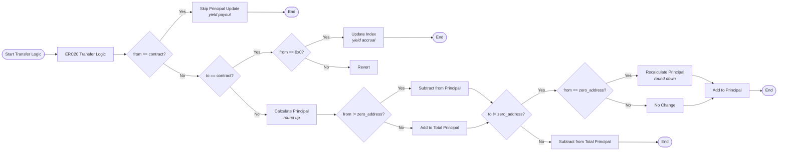

# USDN Solidity Contract

## Overview

The `NobleDollar` contract is the **Solidity implementation** of the Noble Dollar (USDN) token that complements the Cosmos SDK module live on Noble. This contract brings the yield-bearing capabilities of the Noble Dollar to Ethereum Virtual Machine (EVM) compatible chains through Hyperlane.

## Key Features

### Yield-Bearing Token Mechanics
- **Principal-based accounting**: Tracks user principal amounts separately from token balances
- **Automatic yield accrual**: Yield is distributed proportionally to all token holders based on their principal
- **Claimable yield**: Users can claim their accumulated yield through the `claim()` function
- **Index-based calculations**: Uses a scaled index (1e12) to calculate yield distributions

### Cross-Chain Interoperability
- **Hyperlane Integration**: Inherits from `HypERC20` for seamless cross-chain transfers
- **Cross-chain yield distribution**: Receives yield from Noble via Hyperlane
- **Unified token experience**: Maintains consistent yield mechanics across all supported chains

## Architecture

The contract extends Hyperlane's `HypERC20` token router to provide:

1. **ERC20 functionality** with additional yield-bearing features
2. **Cross-chain messaging** for yield distribution and token transfers
3. **Principal accounting** to track ownership shares for yield calculations
4. **Automatic yield updates** when new yield is received from Noble

## Core Functions

### View Functions

- `index()`: Returns the current yield index used for calculations
- `totalPrincipal()`: Returns the total principal amount across all holders
- `principalOf(address)`: Returns the principal amount for a specific account
- `yield(address)`: Calculates claimable yield for a specific account

### User Functions

- `claim()`: Claims all available yield for the caller
- Standard ERC20 functions (transfer, approve, etc.) with yield-aware accounting

## The `_update` Function

The `_update` function is the core of the yield-bearing mechanism. It overrides the standard ERC20 transfer logic to handle principal accounting and yield distribution.

### Function Behavior Breakdown

1. **Yield Payout** (`from == contract`): When the contract pays out yield to users, no principal updates are needed
2. **Yield Accrual** (`to == contract && from == 0x0`): When new yield is minted to the contract (from Noble):
   - Updates the global index based on new total supply
   - Emits `IndexUpdated` event
3. **Invalid Transfer** (`to == contract && from != 0x0`): Prevents users from sending tokens directly to the contract
4. **Regular Operations**: For normal transfers, minting, and burning:
   - Calculates principal using ceiling division for accuracy
   - Updates sender/recipient principal balances
   - Maintains total principal accounting

## Security Features

- **Rounding Protection**: Uses ceiling division to prevent principal manipulation
- **Transfer Restrictions**: Prevents unauthorized transfers to the contract address
- **Index Validation**: Ensures yield calculations remain consistent across operations

## Events

- `IndexUpdated`: Emitted when yield is accrued and the index is updated
- `YieldClaimed`: Emitted when a user claims their yield
- Standard ERC20 events for transfers and approvals

## Deployment

The contract is deployed with:
- **Decimals**: 6 (matching USDN on Noble)
- **Hyperlane domain**: Configured for the target chain
- **Initial index**: 1e12 (representing 1.0 with 12 decimal places)

## Integration

To integrate with the NobleDollar contract:

1. **Standard ERC20 Integration**: Use standard ERC20 interfaces for basic operations
2. **Yield Monitoring**: Listen for `IndexUpdated` events to track yield accrual
3. **Yield Claims**: Call `yield(address)` to check claimable amounts and `claim()` to collect yield
4. **Cross-Chain Operations**: Utilize Hyperlane's routing for cross-chain transfers

## License

Copyright 2025 NASD Inc. All rights reserved.

Licensed under the Apache License, Version 2.0.
